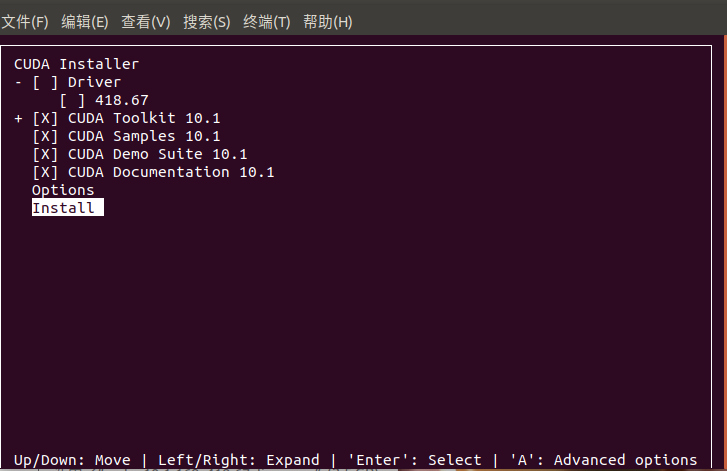

Title: 部署Nvidia，TensorFlow，Python开发环境
Date: 2023-08-11
Category: Commonknowledge
Tags: blog,TensorFlow,Python,Nvidia,CUDA,cuDNN
Slug: Deploy-GPU-TensorFlow-Environment
Author: youareeverysingleday

## Understanding

1. CUDA是nvidia的机器学习驱动。
2. cuDNN相当于是CUDA在深度学习上的补丁。cuDNN其实是CUDA的一个补丁，专为深度学习运算进行优化的。

## References

1. CUDA安装<https://blog.csdn.net/h3c4lenovo/article/details/119003405>。
2. windows安装步骤参考很清晰<https://www.bilibili.com/video/BV1rd4y187nM>。
3. Linux下的tensorflow, CUDA, cuDNN版本对应情况。官方建议构建配置：<https://tensorflow.google.cn/install/source?hl=zh-cn>。

## 安装步骤

### Linux环境

1. Linux配置环境对应关系。
    20230920查询结果(只显示了Python3和TensorFlow2以上的对应关系)。可以看到CUDA能够支持的最新tensorflow的版本为2.6.0，Python的版本为3.9。所以不能安装最新的tensorflow和python版本。

    |版本|Python|版本|编译器|构建工具|cuDNN|CUDA|
    |---|---|---|---|---|---|---|
    |tensorflow-2.6.0|3.6-3.9|GCC 7.3.1| 2019|Bazel 3.7.2|8.1|11.2|
    |tensorflow-2.5.0|3.6-3.9|GCC 7.3.1| 2019|Bazel 3.7.2|8.1|11.2|
    |tensorflow-2.4.0|3.6-3.8|GCC 7.3.1| 2019|Bazel 3.1.0|8.0|11.0|
    |tensorflow-2.3.0|3.5-3.8|GCC 7.3.1| 2019|Bazel 3.1.0|7.6|10.1|
    |tensorflow-2.2.0|3.5-3.8|GCC 7.3.1| 2019|Bazel 2.0.0|7.6|10.1|
2. 查看是否安装显卡
    ```shell
    lspci | grep -i nvidia
    ```
    显示的信息如下：
    ```log
    04:00.0 VGA compatible controller: NVIDIA Corporation GM206 [GeForce GTX 960] (rev a1)
    04:00.1 Audio device: NVIDIA Corporation GM206 High Definition Audio Controller (rev a1)
    ```
3. 查看显卡信息
    ```shell
    nvidia-smi
    ```
    如果没有安装nvidia驱动，那么显示信息如下：
    ```log
    Command 'nvidia-smi' not found, but can be installed with:

    sudo apt install nvidia-utils-435         # version 435.21-0ubuntu7, or
    sudo apt install nvidia-utils-440         # version 440.82+really.440.64-0ubuntu6
    sudo apt install nvidia-340               # version 340.108-0ubuntu5.20.04.2
    sudo apt install nvidia-utils-390         # version 390.157-0ubuntu0.20.04.1
    sudo apt install nvidia-utils-450-server  # version 450.248.02-0ubuntu0.20.04.1
    sudo apt install nvidia-utils-470         # version 470.199.02-0ubuntu0.20.04.1
    sudo apt install nvidia-utils-470-server  # version 470.199.02-0ubuntu0.20.04.1
    sudo apt install nvidia-utils-525         # version 525.125.06-0ubuntu0.20.04.3
    sudo apt install nvidia-utils-525-server  # version 525.125.06-0ubuntu0.20.04.2
    sudo apt install nvidia-utils-535         # version 535.86.05-0ubuntu0.20.04.2
    sudo apt install nvidia-utils-535-server  # version 535.54.03-0ubuntu0.20.04.1
    sudo apt install nvidia-utils-418-server  # version 418.226.00-0ubuntu0.20.04.2
    ```
4. 查看可以安装的nvidia驱动版本。
   ```shell
    ubuntu-drivers devices
   ```
    显示信息如下，可以看到有一条中包含"recommended"的信息。这一条对应的就是推荐安装的驱动版本。
   ```log
    == /sys/devices/pci0000:00/0000:00:1c.4/0000:04:00.0 ==
    modalias : pci:v000010DEd00001401sv00001458sd000036B9bc03sc00i00
    vendor   : NVIDIA Corporation
    model    : GM206 [GeForce GTX 960]
    driver   : nvidia-driver-525-server - distro non-free
    driver   : nvidia-driver-535-server - distro non-free
    driver   : nvidia-driver-418-server - distro non-free
    driver   : nvidia-driver-535 - distro non-free recommended
    driver   : nvidia-driver-470-server - distro non-free
    driver   : nvidia-driver-525 - distro non-free
    driver   : nvidia-driver-470 - distro non-free
    driver   : nvidia-driver-390 - distro non-free
    driver   : nvidia-driver-450-server - distro non-free
    driver   : xserver-xorg-video-nouveau - distro free builtin
   ```
6. 安装驱动源
   ```shell
    sudo add-apt-repository ppa:graphics-drivers/ppa
    sudo apt update
   ```
7. 安装驱动
    推荐使用该命令来更新nvidia驱动。
    ```shell
    sudo apt install nvidia-driver-XXX
    ```
    ```shell
    sudo ubuntu-drivers autoinstall
    ```
    这个命令会将所有合适的驱动都更新。不建议使用。
8. 安装完驱动之后需要将ubuntu重启，然后再用nvidia-smi查看显卡信息。
9. Ubuntu 20.04默认g++9版本太高，会导致CUDA无法安装，因此要先降低g++版本。
   1. 查看gcc版本。
        ```shell
        gcc -v
        ```
        原始ubuntu的使用的gcc的版本是9.4.0。
    2. 降低gcc版本。
        ```shell
        sudo apt-get install gcc-7 g++-7

        sudo update-alternatives --install /usr/bin/gcc gcc /usr/bin/gcc-7 9
        sudo update-alternatives --install /usr/bin/gcc gcc /usr/bin/gcc-9 1
        
        sudo update-alternatives --display gcc
        
        sudo update-alternatives --install /usr/bin/g++ g++ /usr/bin/g++-7 9
        sudo update-alternatives --install /usr/bin/g++ g++ /usr/bin/g++-9 1
        
        sudo update-alternatives --display g++
        ```
10. 下载对应的CUDA
    1. 查看ubuntu下CPU的架构：
        ```shell
        uname -m
        ```
    2. 这里下载的是CUDA Toolkit 11.2.2版本。选择runfile文件下载。
        ```shell
        sudo wget https://developer.download.nvidia.com/compute/cuda/11.2.2/local_installers/cuda_11.2.2_460.32.03_linux.run
        sudo sh cuda_11.2.2_460.32.03_linux.run
        ```
        第一句是下载cuda。第二句是安装。需要注意的是gcc版本已经降低了才能正常安装。
    3. 在运行了sudo sh cuda_11.2.2_460.32.03_linux.run之后会出现需要选择的选项：
       1. 选择Continue。 
       2. 填入accept。 
       3. 因为之前已经安装的nvidia的驱动，所以这里不用再选在Driver选项。其中CUDA Toolkit 11.2是必须的，其他的可选。这里是都选了。注意图片里面显示的是10.2的版本。在本机安装的是11.2版本。
       4. 注意事项：
          1. 在ssh端无法显示上述安装步骤。只能在本机安装。
          2. 安装的过程没有任何进度显示。只有最后安装完成之后有信息输出。过程需要大约5分钟的时间。
          3. 在没有安装成功cuda_11.2.2_460.32.03_linux.run的现象是/usr/local目录下是没有包含cuda名字的文件夹的。
          4. 之后才能对环境变量进行配置。
            

    4. 使用nvidia-smi可以看到出现GPU信息。
        ```log
        +---------------------------------------------------------------------------------------+
        | NVIDIA-SMI 535.104.05             Driver Version: 535.104.05   CUDA Version: 12.2     |
        |-----------------------------------------+----------------------+----------------------+
        | GPU  Name                 Persistence-M | Bus-Id        Disp.A | Volatile Uncorr. ECC |
        | Fan  Temp   Perf          Pwr:Usage/Cap |         Memory-Usage | GPU-Util  Compute M. |
        |                                         |                      |               MIG M. |
        |=========================================+======================+======================|
        |   0  NVIDIA GeForce GTX 960         Off | 00000000:04:00.0 Off |                  N/A |
        |212%   43C    P8              14W / 130W |    226MiB /  2048MiB |      0%      Default |
        |                                         |                      |                  N/A |
        +-----------------------------------------+----------------------+----------------------+

        +---------------------------------------------------------------------------------------+
        | Processes:                                                                            |
        |  GPU   GI   CI        PID   Type   Process name                            GPU Memory |
        |        ID   ID                                                             Usage      |
        |=======================================================================================|
        |    0   N/A  N/A      1258      G   /usr/lib/xorg/Xorg                           54MiB |
        |    0   N/A  N/A      1716      G   /usr/lib/xorg/Xorg                          144MiB |
        |    0   N/A  N/A      1852      G   /usr/bin/gnome-shell                          6MiB |
        |    0   N/A  N/A      3435      G   /usr/lib/firefox/firefox                      8MiB |
        +---------------------------------------------------------------------------------------+
        ```
11. 配置环境变量
    1. ~/.表示的路径是当前用户主目录，也就是当前登录用户的用户目录。我登录用户是chen。cd ~。这里~代表的就是/home/chen/。如果使用的是root用户（也就是sudo su之后的目录环境中），那么这里~ 代表的就是/root目录。
    2. ctrl+H可以显示desktop文件夹中的隐藏文件。
    3. 设置环境变量
    4. 打开.bashrc文件
      ```shell
      vim ~/.bashrc
      ```
    5. 最末尾添加下列内容。
      ```shell
      # cuda安装位置
      export PATH=$PATH:/usr/local/cuda-11.2/bin
      export LD_LIBRARY_PATH=$LD_LIBRARY_PATH:/usr/local/cuda-11.2/lib64
      export LIBRARY_PATH=$LIBRARY_PATH:/usr/local/cuda-11.2/lib64
      ```
    6. 使用使得环境变量生效。
      ```shell
      source ~/.bashrc
      ```
    7. 验证是否生效。
      ```shell
      nvcc -V
      ```
      安装成功的情况下输出信息如下：
      ```log
      nvcc: NVIDIA (R) Cuda compiler driver
      Copyright (c) 2005-2021 NVIDIA Corporation
      Built on Sun_Feb_14_21:12:58_PST_2021
      Cuda compilation tools, release 11.2, V11.2.152
      Build cuda_11.2.r11.2/compiler.29618528_0
      ```
      在没有安装成功的情况下，会提示没有nvcc命令。系统提示：
      ```shell
      Command 'nvcc' not found, but can be installed with: 
      sudo apt install nvidia-cuda-toolkit
      ```
      没必要执行上述提示信息，因为在安装CUDA（cuda_11.2.2_460.32.03_linux.run）时已经选择安装了toolkit。实际上就是环境变量没有配置成功，或者配置了没有使用source ~/.bashrc来使得环境参数生效。
      如果配置成功了会出现CUDA的版本信息。
12. 安装cuDNN
    1. 需要在nvidia注册。
    2. 登录之后在<https://developer.nvidia.com/rdp/cudnn-archive>下载。
    3. 需要科学上网下载打开页面。然后不用科学上网的情况下载地址为：<https://developer.nvidia.com/compute/machine-learning/cudnn/secure/8.1.1.33/11.2_20210301/cudnn-11.2-linux-x64-v8.1.1.33.tgz>。
    4. 下载地址有租期。过期之后无法继续下载。在科学上网的情况下很容易中途下载失败。基本上要求5分钟之内下载完成。
    5. 下载完成之后解压。
    6. 使用下列命令将解压出来的目录覆盖到11.5中配置的环境变量目录下。
      ```shell
      sudo cp -i /home/[Account]/Downloads/cudnn-11.2-linux-x86-v8.1.1.33/cuda/include/* /usr/local/cuda-11.2/include/
      sudo cp -i /home/[Account]/Downloads/cudnn-11.2-linux-x86-v8.1.1.33/cuda/lib64/* /usr/local/cuda-11.2/lib64/
      ```
      cp -i参数表示是碰到相同文件名的文件需要询问用户具体如何操作。*表示源目录下的所有文件。

      后面一步说需要赋权，但并不知道具体的含义是什么。
      ```shell
      sudo chmod a+r /usr/local/cuda-11.2/include/cudnn.h
      sudo chmod a+r /usr/local/cuda-11.2/lib64/libcudnn*
      ```
    7. 查看cudnn的版本
      ```shell
      cat /usr/local/cuda-11.2/include/cudnn_version.h | grep CUDNN_MAJOR -A 2
      ```
13. 测试
    1. 测试代码
      ```python
      import tensorflow as tf
      from tensorflow.python.client import device_lib
      print(device_lib.list_local_devices())
      print(tf.test.is_gpu_available())
      ```
    2. 直接在当前情况下使用会报错报错内容为
      ```log
      If you cannot immediately regenerate your protos. some other possible workaround are:
      1. Downgrade the protobuf package to 3.20.x or lower.
      2. Set PROTOCOL_BUFFERS_PYTHON_IMPLEMENTATION=python (but this will use pure-Python parsing and will be much slower).
      ```
      参考解决方法：<https://blog.csdn.net/qq_19313495/article/details/125049344>。
      解决方法：将pip3中安装的protobuf包由当前4.24.3版本降低为3.20.3版本既可以解决该报错。

Completed.

### windows环境

1. anaconda
   1. 官网: <https://www.anaconda.com/>
   2. 添加3个环境变量。
      1. C:\ProgramData\Anaconda3
      2. C:\ProgramData\Anaconda3\Library
      3. C:\ProgramData\Anaconda3\Scripts
   3. 配置虚拟环境。视频中推荐使用python3.8版本。
      1. 创建名为“test-tf”的conda虚拟环境：conda create --name test-tf python=3.8.15
      2. 进入名为“test-tf”的conda虚拟环境：conda activate test-tf
      3. 列出所有conda虚拟环境；conda env list
      4. 退出当前的conda虚拟环境：conda deactivate
2. install IDE。自行选择。
3. install CUDA
   1. 严格按照官网建议对应的版本下载安装：<https://developer.nvidia.com/cuda-toolkit-archive>。版本对应关系看本部分的最后。
   2. reference 1 中推荐的是11.8版本。
   3. 安装时取消安装Display Driver和visual studio intergration。之后直接下一步即可。
   4. 如果修改了安装路径，一定要记清楚，后面有用。
   5. CUDA参考手册<https://docs.nvidia.com/cuda/cuda-toolkit-release-notes/index.html>
4. install cuDNN
   1. cuDNN是针对神经网络的加速库。实际上相当于是CUDA的补丁。
   2. 官方地址<https://developer.nvidia.com/rdp/cudnn-archive>。
   3. 下载cuDNN需要nvidia的账号。
   4. 解压下载好的安装包，将其复制粘贴到CUDA的根目录。如果有重复文件覆盖即可。
   5. 添加环境变量
      1. CUDA的安装路径
         1. C:\Program Files\NVIDIA GPU Computing Toolkit\CUDA\v11.2\bin
         2. C:\Program Files\NVIDIA GPU Computing Toolkit\CUDA\v11.2\libnvvp
         3. C:\Program Files\NVIDIA GPU Computing Toolkit\CUDA\v11.2\include
         4. C:\Program Files\NVIDIA GPU Computing Toolkit\CUDA\v11.2\extras\CUPTI\lib64
         5. C:\Program Files\NVIDIA GPU Computing Toolkit\CUDA\v11.2\lib
      2. C:\Program Files\NVIDIA Corporation\Nsight Compute 2020.3.0\
5. 检查CUDA配置
   1. 命令：nvcc -V
      1. 可以看到相关的CUDA版本信息。
   2. 测试命令，共2个。
      1. 首先进入:\Program Files\NVIDIA GPU Computing Toolkit\CUDA\v11.2\extras\demo_suite 目录下。
      2. .\bandwidthTest.exe
      3. .\deviceQuery.exe
      4. 如果上述2个命令最后都显示输出"Result = PASS"字样。表示CUDA配置成功。
6. Install Tensorflow
   1. 需要和CUDA的版本对应。
   2. 进入之前在conda中创建的虚拟环境：conda activate test-tf
   3. pip install tensorflow==2.6.0
   4. 不需要安装tensorflow-gpu，在安装tensorflow的时候会自动调用GPU进行加速。
   5. 在执行代码的时候查看一下任务管理其就可以知道是哪个模块在运行。
7. check keras vision
   1. pip install tensorflow==2.6.0直接安装会看到keras是2.11.0版，需要将keras与tensorflow的版本保持一致。
   2. 重新安装keras，并选择版本：pip install keras==2.6.0 。
8. check tensorflow
   1. 进入conda虚拟环境：conda activate test-tf 。
   2. 进入Python环境：python 。
   3. 导入tensorflow库：import tensorflow as tf 。
   4. 查看GPU版本信息，并返回GPU是否可用：tf.test.is_gpu_available() 。
      1. 返回值为True表示GPU可用。
   5. 查看服务类型：tf.config.list_physical_devices('GPU') 。
   6. 退出python环境：exit() 。
9. 在视频最后用代码进行测试时，使用GPU的训练时并没有专门的代码来选择或者指定GPU。而在用CPU训练时，使用了os.environ["CUDA_VISIBLE_DEVICES"] = "-1"来禁用GPU。使用典型的卷积神经网络来验证效果会比较明显。

Completed.

### Tips

1. CUDA核心数：决定训练速度。
2. 显存大小：决定可以训练多大的模型以及训练时的最大batch size。对于较大规模的训练而言尤其敏感。
3. 屏蔽GPU：
   1. 显卡开关：os.environ["CUDA_VISIBLE_DEVICES"] = "-1" 。
   2. python验证代码：
   ```python
   cpus = tf.config.list_physical_devices(devices_type='CPU')
   tf.config.set_visible_devices(devices=cpus)
   ```
4. tensorflow 2.1（该版本及以上版本） 默认安装(pip install tensorflow)已经同时支持CPU和GPU。
5. CPU和GPU谁快？GPU和CPU的选择和模型的类型有关。例如，如果是卷积神经网络则GTX1050胜过i7，但强化学习则不一定。
6. 官方建议构建配置：<https://tensorflow.google.cn/install/source_windows#gpu>。可以看到CUDA能够支持的最新tensorflow的版本为2.6.0，Python的版本为3.9。所以不能安装最新的tensorflow和python版本。

    20230909查询结果：
    |版本|Python|版本|编译器|构建工具|cuDNN|CUDA|
    |---|---|---|---|---|---|---|
    |tensorflow_gpu-2.6.0|3.6-3.9|MSVC| 2019|	Bazel 3.7.2|8.1|11.2|
    |tensorflow_gpu-2.5.0|3.6-3.9|MSVC| 2019|Bazel 3.7.2|8.1|11.2|
    |tensorflow_gpu-2.4.0|3.6-3.8|MSVC| 2019|Bazel 3.1.0|8.0|11.0|
    |tensorflow_gpu-2.3.0|3.5-3.8|MSVC| 2019|Bazel 3.1.0|7.6|10.1|
    |tensorflow_gpu-2.2.0|3.5-3.8|MSVC| 2019|Bazel 2.0.0|7.6|10.1|
    |tensorflow_gpu-2.1.0|3.5-3.7|MSVC| 2019|Bazel 0.27.1-0.29.1|7.6|10.1|
    |tensorflow_gpu-2.0.0|3.5-3.7|MSVC| 2017|Bazel 0.26.1|7.4|10|
    |tensorflow_gpu-1.15.0|3.5-3.7|MSVC| 2017|Bazel 0.26.1|7.4|10|
    |tensorflow_gpu-1.14.0|3.5-3.7|MSVC| 2017|Bazel 0.24.1-0.25.2|7.4|10|
    |tensorflow_gpu-1.13.0|3.5-3.7|MSVC| 2015 update 3|Bazel 0.19.0-0.21.0|7.4|10|


## 报错（20230909之前的经验，也就是没有参考reference1之前的经验）

1. tensorflow的GPU环境搭建粗略步骤<https://www.tensorflow.org/install/gpu>
2. 安装步骤说明：
   1. 首先安装服务器的驱动，也就是0. FusionServer iDriver-Win2K16-Driver-V115.zip。
   2. 安装操作系统的补丁1. windows10.0-kb4038782-x64_5cc8dccc86516830eb0b1aa030d67f482dd05af0.msu，安装了之后才能安装Nvidia的驱动。
   3. 安装Nvidia驱动2. 472.50-data-center-tesla-desktop-winserver-2019-2016-international.exe。
   4. 安装CUDA 3. cuda_11.5.0_496.13_win10.exe
   5. 将4. cudnn-windows-x86_64-8.3.2.44_cuda11.5-archive.zip中的cudnn64_8.dll文件拷贝到C:\Program Files\NVIDIA GPU Computing Toolkit\CUDA\v11.5\bin目录下。
   END
3. 当前使用的系统版本
|编号|名称|版本|说明|
|---|---|---|---|
|1|windows server|2016|nvidia要求的window版本最新的只能是这个。|
|2|GPU驱动|472.50-data-center-tesla-desktop-winserver-2019-2016-international.exe||
|3|CUDA|11.5|下载地址<>。**11.6版本的CUDA没有对应版本的cuDNN**。|
|4|cuDNN|cudnn-windows-x86_64-8.3.2.44_cuda11.5-archive|下载地址<https://developer.nvidia.com/rdp/cudnn-download>。注意对应x86_64的两个windows文件都需要下载，一个是Local Installer for Windows (Exe)和Local Installer for Windows (Zip)，前面是安装cuDNN，后面的zip是用于补全部分dll文件的。|
|5||||

4. 使用框架时报错

    ```Python
    import tensorflow as tf

    tf.test.is_gpu_available()

    import tensorflow as tf
    print("TF version:", tf.__version__)

    # 检测Tensorflow是否支持GPU
    print("GPU is ", "available" if tf.test.is_gpu_available() else "NOT available.")
    ```

    代码的时候报以下错误

    ```Script
    PS D:\codeSpace\test> & D:/Python310/python.exe d:/codeSpace/test/test.py
    WARNING:tensorflow:From d:\codeSpace\test\test.py:3: is_gpu_available (from tensorflow.python.framework.test_util) is deprecated and will be removed in a future version.
    Instructions for updating:
    Use `tf.config.list_physical_devices('GPU')` instead.
    2022-02-09 15:21:51.500071: I tensorflow/core/platform/cpu_feature_guard.cc:151] This TensorFlow binary is optimized with oneAPI Deep Neural Network Library (oneDNN) to use the following CPU instructions in performance-critical operations:  AVX AVX2
    To enable them in other operations, rebuild TensorFlow with the appropriate compiler flags.
    2022-02-09 15:21:52.540180: W tensorflow/stream_executor/platform/default/dso_loader.cc:64] Could not load dynamic library 'cudnn64_8.dll'; dlerror: cudnn64_8.dll not found
    2022-02-09 15:21:52.540269: W tensorflow/core/common_runtime/gpu/gpu_device.cc:1850] Cannot dlopen some GPU libraries. Please make sure the missing libraries
    mentioned above are installed properly if you would like to use GPU. Follow the guide at https://www.tensorflow.org/install/gpu for how to download and setup
    the required libraries for your platform.
    Skipping registering GPU devices...
    TF version: 2.8.0
    2022-02-09 15:21:52.550397: W tensorflow/core/common_runtime/gpu/gpu_device.cc:1850] Cannot dlopen some GPU libraries. Please make sure the missing libraries
    mentioned above are installed properly if you would like to use GPU. Follow the guide at https://www.tensorflow.org/install/gpu for how to download and setup
    the required libraries for your platform.
    Skipping registering GPU devices...
    GPU is  NOT available.
    ```

    解决方法：<https://blog.csdn.net/wilde123/article/details/116903346><https://blog.csdn.net/qq_43203949/article/details/108550960>
    解决步骤：
        1. 在<https://developer.nvidia.com/rdp/cudnn-download>连接中下载对应的cudnn-windows-x86_64-8.3.2.44_cuda11.5-archive.zip文件。
        2. 将其解压，然后将其中bin目录中的cudnn64_8.dll文件拷贝到C:\Program Files\NVIDIA GPU Computing Toolkit\CUDA\v11.5\bin目录下即可。
    原因就是在C:\Program Files\NVIDIA GPU Computing Toolkit\CUDA\v11.5\bin目录下缺失cudnn64_8.dll文件。

5. 推荐使用的查看GPU状态代码<http://t.zoukankan.com/Renyi-Fan-p-13461855.html>

    ```Python
    gpus = tf.config.list_physical_devices(device_type='GPU')
    cpus = tf.config.list_physical_devices(device_type='CPU')
    print(gpus, cpus)
    ```

6. 这个视频好像不对。需要使用tensorflow来对矩阵进行分解。具体使用[参考视频，从第32分钟之后开始看。](https://www.bilibili.com/video/BV1Cq4y1K7yV?spm_id_from=333.337.search-card.all.click)

    ```pyhont
    # 在jupyter中执行的代码

    # cell_1
    !nvcc -V

    # cell_2
    !nvidia-smi
    ```

    这两个代码执行成功之后说明cuda和python相关的环境就配置成功了。

