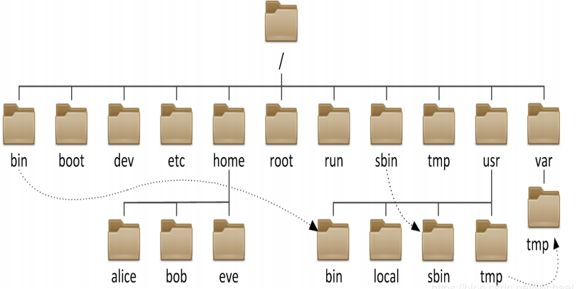
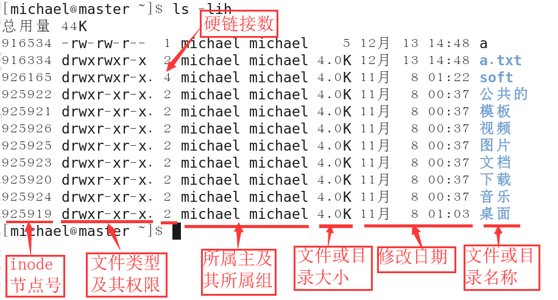

Title: Linux使用经验
Date: 2023-08-31
Category: Commonknowledge
Tags: blog,Linux
Slug: Linux-Common-Experience
Author: youareeverysingleday

## Experience

1. 使用Ubuntu server版本下载地址<https://cn.ubuntu.com/server>。
2. ubuntu server安装图形界面<https://zhuanlan.zhihu.com/p/373773218>。如果你是出于学习和调研等实验性的目的，那么你可以进行这些操作。请不要在生产环境的服务器上添加 GUI。后续删除 GUI 时可能会导致依赖问题，有些情况会破坏系统。
   1. 首先升级apt：sudo apt update
   2. 安装图形界面：sudo apt install ubuntu-desktop
      1.  安装的是GNOME桌面，因为它是 Ubuntu 默认的桌面。
   3. 安装“显示管理器”或“登录管理器”的组件。这个工具的功能是在管理用户对话和鉴权时启动 显示服务器 并加载桌面。：sudo apt install lightdm
   4. 启动显示管理器并加载 GUI：sudo service lightdm start
      1. 检查当前的显示管理器：cat /etc/X11/default-display-manager
   5. 关闭GUI：sudo service lightdm stop
3. 删除GUI（请注意在某些情况下删除 GUI 可能会带来依赖问题，因此请备份好重要数据或创建一个系统快照）：
   1. sudo apt remove ubuntu-desktop
   2. sudo apt remove lightdm
   3. sudo apt autoremove
   4. sudo service lightdm stop
4. 安装输入法
   1. reference:<https://zhuanlan.zhihu.com/p/529892064>。
   2. 注意的地方：安装了输入法之后需要重启一次才能看到。

### connect to Ubuntu by SSH from windows

reference: <https://linuxize.com/post/how-to-enable-ssh-on-ubuntu-20-04/>

1. ubuntu安装ssh
   1. sudo apt update
   2. sudo apt install openssh-server
2. windows 10安装powershell。通过windows store安装。
3. ubuntu查看ssh状态
   1. sudo systemctl status ssh
   2. 以下Log表示正在运行。
      ```log
      ● ssh.service - OpenBSD Secure Shell server
      Loaded: loaded (/lib/systemd/system/ssh.service; enabled; vendor preset: enabled)
      Active: active (running) since Mon 2020-06-01 12:34:00 CEST; 9h ago
      ```
4. Ubuntu 自带一个配置防火墙配置工具，称为 UFW。如果防火墙在你的系统上被启用，请确保打开了 SSH 端口。
   1. sudo ufw allow ssh
   2. 就这些。现在你可以从任何远程机器上通过 SSH 连接到你的 Ubuntu 系统。Linux 和 macOS 系统默认都安装了 SSH 客户端。想要从一个 Window 机器上连接，使用一个 SSH 客户端，例如:PUTTY（我使用powershell）。
5. 连接到ubuntu的SSH
   1. 想要在局域网内连接到你的 Ubuntu 机器，以下面的格式输入ssh命令，加上用户名和IP地址。
   2. ssh username@ip_address
   3. 确保你将`username`修改成你自己的用户名，`ip_address`修改成你安装了 SSH 的 Ubuntu 机器的 IP 地址。
   4. 如果你不知道你的 IP 地址，你可以使用ip命令轻易地找到它：ip a
6. 通过IP 地址，通过运行下面的ssh 命令登录远程机器：
   1. ssh linuxize@10.0.2.15
   2. 不用在意下列信息
      ```log
      The authenticity of host '10.0.2.15 (10.0.2.15)' can't be established.
      ECDSA key fingerprint is SHA256:Vybt22mVXuNuB5unE++yowF7lgA/9/2bLSiO3qmYWBY.
      Are you sure you want to continue connecting (yes/no)?
      ```
7. 想要在你的 Ubuntu 系统上禁用 SSH 服务器，简单停止 SSH 即可。
   1. 禁用：sudo systemctl disable --now ssh
   2. 重启：sudo systemctl enable --now ssh

### Install Python

Reference 安装python参考:<https://blog.csdn.net/Hiking_Yu/article/details/104373221>。
Reference 安装pip参考:<https://zhuanlan.zhihu.com/p/418368712>。

1. Ubuntu 20.04.x Desktop中很多组件都依赖Python 3.8.x。不要直接删除系统自带的python3。直接会导致gnome也被删除。建议安装其他版本的Python，然后将修改指向。
   1. 参考:<https://zhuanlan.zhihu.com/p/403819436>。
2. update-alternatives相关命令
   1. 列出所有可用的 python 替代版本信息：update-alternatives --list python3。
      1. 如果下面出现以下信息表示还没有可以替代的版本
      ```log
      update-alternatives: error: no alternatives for python3
      ```
   2. 对于ubuntu 20.04而言安装可替代的版本。注意：这里只能设置为python3这个标识，不能设置为python这个标识，因为后面需要安装pip的会报错，推测可能是apt无法识别python这个标识导致的。
      1. 错误的命令：
         1. sudo update-alternatives --install /usr/bin/python python /usr/bin/python3.10 1
         2. sudo update-alternatives --install /usr/bin/python python /usr/bin/python3.8 2
      2. 正确的命令：
         1. sudo update-alternatives --install /usr/bin/python3 python3 /usr/bin/python3.10 1
         2. sudo update-alternatives --install /usr/bin/python3 python3 /usr/bin/python3.8 2
      3. 安装之后再次查看python的对应关系：sudo update-alternatives --list python3。
   3. 配置python命令对应的版本：sudo update-alternatives --config python3
   ```log
   There are 2 choices for the alternative python3 (providing /usr/bin/python3).

   Selection    Path                 Priority   Status
   ------------------------------------------------------------
   * 0            /usr/bin/python3.10   1         auto mode
   1            /usr/bin/python3.10   1         manual mode
   2            /usr/bin/python3.8    1         manual mode

   Press <enter> to keep the current choice[*], or type selection number: 1
   ```
   和之前的配置对应，选择1作为默认版本。
   1. 然后再用python3 --version查看版本情况。
3. 对于ubuntu 20.04而言安装pip。需要的python命令是python3。
   1. 直接运行pip3 --version会报错。此时需要修复distutils。
      1. 错误信息为：ModuleNotFoundError: No module named 'distutils.util'。
      2. 修复distutils：sudo apt install python3.10-distutils
   2. 重装pip
      1. 重装pip：curl https://bootstrap.pypa.io/get-pip.py -o get-pip.py
         1. 新的ubuntu里面是没有curl组件的。需要使用apt install curl安装curl。
      2. 重装pip：python3 get-pip.py
         1. 参考: <https://blog.csdn.net/fanjinglian_/article/details/130077179>。
         2. 使用python3 get-pip.py之后出现如下报错：
         ```log
         WARNING: The scripts pip, pip3 and pip3.10 are installed in '/home/[username]/.local/bin' which is not on PATH.
         Consider adding this directory to PATH or, if you prefer to suppress this warning, use --no-warn-script-location.
         ```
         使用命令来解决。实际上是指定pip的版本：
            1. echo 'export PATH=/home/[username]/.local/bin:$PATH' >>~/.bashrc
            2. source ~/.bashrc
      3. 修改pip指向：sudo vi /usr/local/bin/pip3
         ```python
         #!/usr/bin/python3
         #-*- coding: utf-8 -*-
         import re
         import sys
         from pip._internal.cli.main import main
         if __name__ == '__main__':
            sys.argv[0] = re.sub(r'(-script\.pyw|\.exe)?$', '', sys.argv[0])
            sys.exit(main())
         ```
            1. vi中的编辑命令。
               1. :q! 强制退出，并且不保存。
               2. i 进入编辑模式。
               3. ESC 退出编辑模式。
               4. :wq 保存并退出。
            2. 最后使用cat /usr/local/bin/pip3查看刚刚写入的内容。
      4. 最后使用pip3 --version查看版本是否出差。Completed.
   3. 修改pip的镜像源：
      1. 这是在windows环境中修改下载源的命令：pip3 config set global.index-url https://pypi.tuna.tsinghua.edu.cn/simple 。 在ubuntu环境中该方法无效。
      2. 参考：<https://blog.csdn.net/limengshi138392/article/details/111315014>
      3. 创建pip.conf文件
         ```shell
         cd ~                   # 进入家目录 
         mkdir .pip             # 新建.pip隐藏文件夹
         # 或者 mkdir -p .config/pip      
         cd .pip                # 进入.pip文件夹
         # 或者 cd .config/pip               
         touch pip.conf         # 新建pip.conf文件
         vim pip.conf           # 用vim编辑pip.conf文件
         ```
      4. pip.conf文件内容为：
         ```log
         [global]
         index-url = https://pypi.tuna.tsinghua.edu.cn/simple
         trusted-host = pypi.tuna.tsinghua.edu.cn
         ```
   4. 查看当前pip源：pip3 config list 。完成。
## File System

reference: <https://zhuanlan.zhihu.com/p/128669031>

Unix系统把一切资源都看作是文件，包括硬件设备。硬件所形成的文件，通常称为设备文件。这样用户就可以用读写文件的方式实现对硬件的访问，这样带来的优势也是显而易见的。Unix 权限模型也是围绕文件的概念来建立的，所以对设备也就可以同样处理了。

根目录是整个文件系统中最重要的一个目录，位于Linux文件系统目录结构的顶层。因为不但所有的目录都是由根目录衍生出来的， 同时根目录也与操作系统的开机、还原、系统修复等行为有关。

> 系统开机所需要的特定文件数据有：核心文件、开机程序、 函数库等等。如果系统出现错误，根目录也必须要包含有能够修复文件系统的程序才行。因此FHS标准建议：根目录(/)所在分区应该越小越好， 且应用程序所安装的软件最好不要与根目录放在同一个分区内，保持根目录越小越好。 如此不但效能较佳，根目录所在的文件系统也较不容易发生问题。说白了，就是根目录和Windows的C盘一个样。因为越大的分区内你会放入越多的数据，如此一来根目录所在分区就可能会有较多发生错误的机会。

因为根目录与开机有关，开机过程中仅有根目录会被挂载， 其他分区则是在开机完成之后才会持续的进行挂载行为。因此根目录下与开机过程有关的目录， 就应该与根目录放在同一个分区里。这些目录分别是：/etc，/bin，/dev，/lib，/sbin。



|文件名|说明|
|---|---|
|/|根目录，位于Linux文件系统目录结构的顶层。通常根目录下只存放目录，不存放文件，/etc，/bin，/dev，/lib，/sbin应该和根目录放置在一个分区中。|
|/bin，/usr/bin|该目录为命令文件目录，也称为二进制目录。包含了供系统管理员及普通用户使用的重要的linux命令和二进制（可执行）文件，包含shell解释器等。|
|/boot| 该目录中存放系统的内核文件和引导装载程序文件，/boot/vmlinuz为linux的内核文件，以及/boot/gurb。建议单独分区，分区大小100M即可。|
|/dev| 设备（device）文件目录，存放linux系统下的设备文件，访问该目录下某个文件，相当于访问某个设备（终端、磁盘驱动器、光驱及网卡等，包括字符设备和块设备）等，常用的是挂载光驱mount /dev/cdrom/mnt。**例如你的第一块硬盘的代码是 /dev/hda1**。|
|/etc| 系统配置文件目录，该目录存放系统的大部分配置文件和子目录，不建议在此目录下存放可执行文件。该目录下的文件由系统管理员来使用，普通用户对大部分文件有只读权限。|
|/home| 系统默认的用户宿主目录，新增用户账号时，用户的宿主目录都存放在此目录下，~表示当前用户的宿主目录。建议单独分区，并设置较大的磁盘空间，方便用户存放数据。|
|/lib，/usr/lib，/usr/local/lib|系统最基本的动态连接资源库，内核模块文件目录。几乎所有的应用程序都用到此资源库。/lib目录存放了所有重要的库文件，其他的库文件则大部分存放在/usr/lib目录下。|
|/lost+fount| 在EXT2或EXT3文件系统中，系统意外崩溃或意外关机时，产生的一些文件碎片放在这里。当系统重新启动时，fsck工具会检查这里，并修复已经损坏的文件系统。|
|/mnt，/media| mnt目录主要用来临时挂载文件系统，为某些设备提供默认挂载点。|
|/opt| 给主机额外安装软件所摆放的目录。|
|/proc| 此目录的数据都在内存中，如系统核心，外部设备，网络状态，由于数据都存放于内存中，所以不占用磁盘空间。|
|/root|系统管理员root的宿主目录，系统第一个启动的分区为/，所以最好将/root和/放置在一个分区下。|
|/sbin，/usr/sbin，/usr/local/sbin|放置系统管理员使用的可执行命令，如fdisk、shutdown、mount等。与/bin不同的是，这几个目录是给系统管理员root使用的命令，一般用户只能"查看"而不能设置和使用。|
|/tmp| 存放系统产生的临时文件，因此重要文件不要放在此目录下。|
|/srv| 服务启动之后需要访问的数据目录，如www服务需要访问的网页数据存放在/srv/www内。|
|/usr| 应用程序存放目录，/usr/bin 存放应用程序， /usr/share 存放共享数据，/usr/lib 存放不能直接运行的，却是许多程序运行所必需的一些函数库文件，/usr/local 存放软件升级包，/usr/share/doc 系统说明文件存放目录。|
|/usr/share/man|程序说明文件存放目录，使用 man ls时会查询/usr/share/man/man1/ls.1.gz的内容。建议单独分区，设置较大的磁盘空间。|
|/var| 放置系统执行过程中经常变化的文件，如随时更改的日志文件 /var/log。|
|/sys|这个目录其实跟/proc非常类似，也是一个虚拟的档案系统，主要也是记录与核心相关的资讯。 包括目前已载入的核心模组与核心侦测到的硬体装置资讯等等。 这个目录同样不占硬盘容量。|
|.|代表当前的目录，也可以使用 ./ 来表示；|
|..|代表上一层目录，也可以 ../ 来代表。|


### 绝对路径与相对路径

在访问文件或目录时，会涉及到所谓的路径。我们根据写法的不同来分成绝对路径(absolute)与相对路径(relative)。

> 绝对路径：由根目录(/)开始写起的文件名或目录名称。例如 /home/hyxy/.bashrc；
> 相对路径：相对于你当前所在路径的写法。 不是以 / 开头的写法就属于相对路径的写法。

举例来说，你目前在 /home/hyxy 这个目录下， 如果想要进入 /var/log 这个目录时，可以怎么写呢？

> cd /var/log --绝对路径写法
> cd ../../var/log --相对路径写法。因为我们的位置是/home/hyxy里，所以要回到上一层（../）到达/home/里，然后再回到上 一层(../)到达根目录，此时才能看到/var，然后向里移动。


### 文件类型

当我们使用命令“ll”查询文件属性时，我们会看到第一列是由10个字符组成的。而10个字符的第一个字符就表示文件类型。



|类型名称|说明|
|---|---|
|-(f)|普通文件|
|d|目录文件|
|b|块设备。就是一些储存数据，以提供系统存取的接口设备。例如你的一号硬盘的代码是 /dev/hda1。|
|c|字符文件。一些串行端口的接口设备，例如键盘、鼠标等等！|
|l|符号链接文件，分为软链接和硬链接。类似于windows系统的快捷方式。|
|p|管道文件，FIFO也是一种特殊的文件类型，它主要的目的是，解决多个程序同时存取一个文件所造成的错误。|
|s|套接字文件，socket。如启动一个MySql服务器时产生的一个mysql.sock文件。|


### 查看文件类型的三种方法

方法1：ls -l或者ll
方法2：file命令
方法3：stat命令