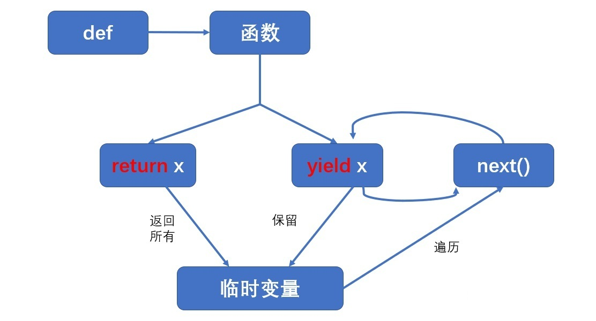

Title: Python基础知识
Date: 2022-08-19
Category: Commonknowledge
Tags: blog,Python
Slug: python-foundation
Author: youareeverysingleday


## 1 Python编程基础概念

1. 5种基本对象类型。
   1. 字符串：string，简记为str
   2. 整数：integer，简记为int
      1. 十进制
      2. 八进制：0o100, -0o100
      3. 十六进制：0x40, -0x40
      4. 二进制：0b100000, -0b100000
   3. 浮点数：float
   4. 布尔型：boolean，简记为bool，True, False。
   5. **复数：complex，1+2j, -1-1j**
2. type()对象(函数)，用于查看对象的类型。不同类型对象的运算规则不同。不同类型的在计算机中的存储形式不一样。
3. 基础运算符
   1. 算术运算符：+,-,*,/,//,%,\*\*。**其中"//"表示的除法是整数除法，也就是小学时候使用的除法，结果得到商**，不包含余数。其中"\*\*"表示的是指数运算。
   2. 关系运算符：==, !=, >=, >, <, <=。
   3. 逻辑运算符：and, or, not。
4. 运算符优先级
5. input和print对象。input用于接收从命令行（键盘）中传来的数据。

   ```python
   radius = float(input("please input radius of circule:"))
   print(1, 2, 3, seq=',', end='\n') # print(value,..., seq=',', end='\n')，seq由于表示输出多个值时之间的分隔符。end表示输出最后的结尾用什么。
   ```

6. 内置函数和内置数学库
   1. range函数。range函数可以接受3个参数，（下限值，上限值，步长），函数会范围一个从下限值开始，到(上限值-1)结束的range对象，该对象中迭代至直接的差值等于步长。如果省略步长，则默认取1；下限值如果省略，那么默认值取0。

   ```python
   # 由于range返回的是range对象，所以需要使用list将其转换为可以输出的类型。completed 1.7 
   list(range(10))
   list(range(1, 10))
   list(range(1, 10, 2))
   ```

7. 程序语句结构
   1. 顺序结构
   2. 选择结构
   3. 循环结构
8. if-else三元表达式

   ```python
   # 下面两个代码逻辑上等价
   # 1. 这是三元表达式。
   maxn = (n if n>m else m)

   # 2. 这是if-else语句。
   if n>m:
      maxn = n
   else:
      maxn = m
   ```

9. while一般用于不确定循环次数的循环。for一般用于知道循环次数的循环。
10. 在python中需要表示包含语句块的时候需要用“:”结尾。比如for、if、else等。
11. for循环
   for variable in 可迭代对象:
       缩进语句块(循环)
   将可迭代对象一个一个取到variable中。可迭代对象可以使：列表、元组、字符串、range对象。

## 2 Python高级数据类型

1. list列表
   1. 列表的索引，从头到尾方向（index）是从0开始计数。从尾到头方向（negative index）是从-1开始计数。
   2. 列表是**可变序列**的对象。
   3. **列表里面存放的数据类型是引用（列表中元素引用的类型可以不一样）**，而不是对象本身，所以可以引用任意对象。列表元素是有序的，所以才能通过位置偏移访问。
   4. 有一种创建里面的方式是listVariable = list(可迭代对象)。所谓可迭代对象是可以从该对象中逐一取出元素的兑现。
   5. 列表的基本操作
      1. 获取列表的长度：len(列表对象)
      2. 列表的连接：列表对象1+列表对象2。
      3. 列表的重复：列表对象*重复数

         ```python
         [1, 2, 3] * 3
         # 输出是[1, 2, 3, 1, 2, 3, 1, 2, 3]
         ```

   6. 索引，取单个的元素：列表名[索引值]（索引值的起始值为0）

      ```python
      list1 = list("abcde")
      list1[0]
      # 输出结果是'a'

      list1[4]
      # 输出结果是'e'
      ```

   7. 分片：列表名[起始索引:终止索引:步长]。三个参数中前两个必须有一个，起始索引的包含在内，终止索引的不在内。最后一个可选，默认值是1。

      ```python
      list1 = list("abcde")
      list1[1:3]
      # 输出结果是['b', 'c']，相当于取了1和2索引位置的值。
      list1[3:]
      # 输出结果是['d', 'e']
      list1[-1::-1]
      # 输出结果是['e', 'd', 'c', 'b', 'a']，这个相当于倒序。
      ```

   8. 嵌套列表可以表用来表示多维数组和矩阵。
   9. 修改列表中的某个值：列表名[索引值]=新对象
   10. 修改列表中一段区间的内容：列表名[切片]=可迭代对象。**注意这里可迭代对象的长度不一定要和切片的长度相同**。

         ```python
         list1 = list("abcde")
         list1[1:3] = range(3)
         # 输出结果是['a', 0, 1, 2, 'd', 'e']。将range(3)产生的0,1,2去替换掉了['b', 'c']。
         ```

   11. 删除列表的一个元素：
       1. del 列表名[索引值]，通过位置定位找到要删除的元素。
       2. 列表名.remove(对象)，通过值定位找到要删除的元素。
       3. 列表名.pop(索引值)，这个函数做了两个动作，第一个动作是将要删除的值输出出来，第二步是将对应索引值的元素删除。
   12. 添加
       1. 插入：列表名.insert(索引值，新对象)。**插入位置的对象及其后的对象依次后移**。
       2. 追加一个对象：列表名.append(新对象)。
       3. 在列表尾部扩展添加多个对象：列表名.extend(可迭代的新对象)

         ````python
         list1 = list("abcde")
         list1.extend(['new', True, 3.14])
         print(list1)
         # 输出结果是['a', 'b', 'c', 'd,' 'e', 'new', True, 3.14]。
         ````

   13. 清空列表：列表名.clear()
   14. 改变列表元素的顺序
       1. 列表名.reverse()。相当于倒序了。

            ````python
            list1 = list("abcde")
            list1.reverse()
            print(list1)
            # 输出结果是['e', 'd', 'c', 'b,' 'a']。
            ````

       2. 列表名.sort()。将列表重新按照ASCII码或者数值大小关系从小到大重新排列。**课程里面说只对英文有效，但实际上对中文同样有效**。这里老师讲错了。列表名.sort(reverse=True)。

         ````python
         list1 = list("debac")
         list1.sort()
         print(list1)
         # 输出结果是['a', 'b', 'c', 'd,' 'e']。
         list1.sort(reverse=True)
         print(list1)
         # 输出结果是['e', 'd', 'c', 'b,' 'a']。
         ````

   15. 查找对象在列表中的索引值：列表名.index(对象)。返回一个对象对应的索引值。如果有重复的对象那么返回第一个对象的索引值。
2. 元组（tuple）
   1. 特性是**不可变序列，不能在对象原位置上进行修改、添加和删除操作**。
   2. 元素也是引用。
   3. 可以元组连接、元组复制、索引操作、分片操作。
   4. 特殊的地方：**创建包含一个元素的元组对象时，需要在元组唯一元素对象后额外添加一个逗号“,”，通过实验是可以的，也就是说不需要最后以逗号结尾**。这里老师讲错了。例如：

      ```python
      t1=(1,) # 变量t1引用包含一个元素的元组对象。
      ```

   5. 不能使用的操作包括：insert, append, remove, pop, clear这些对对象原位置进行修改的操作。
3. 字符串（str）。它是一个可迭代对象。存放的是一个字符序列。**通过3个单引号或者双引号来表示多行字符串**。
   1. 字符串是**不可变序列**对象，和元组类似。
   2. 由于字符串是一个序列，所以也可以进行索引、分片、连接、重复等基本的序列操作。
   3. 转义字符。
   4. 字符串的转换。仅包含数字，小数点和正负号的字符串才有可能转化为数值。
      1. 转化为整数：int(包含数字和正负号的数字字符串)
      2. 转为浮点型：float(包含数字，小数点和正负号的数字字符串)
      3. 将单个字符再起底层编码和字面形式之间转换。
         1. 转化为底层编码：ord(单个字符)。

            ```python
               print(ord('a'))
               print(hex(ord('a')))
               # 输出结果是97
               # 输出结果是0x61
            ```

         2. 转换为字面形式：chr(字符底层编码)。

            ```python
               print(chr(9733))
               print(chr(0x2605))
               # 输出结果是★
               # 输出结果是★
            ```

      4. 查找子串的方法：find, rfind, index, rindex。find从左向右找，rfind从右向左找。
      5. 字符串连接：join
      6. 字符串分割：split, rsplit, splitline
      7. 字符串大小写转换：lower, upper, swapcase。swapcase的用途是将小写变为大写，大写变为小写。这里老师讲错了。
      8. 子串替换：replace。
      9. 去除空格：strip, lstrip, rstrip。
      10. 字符串的格式化。两种形式，第一种类似于C语言中的形式，第二种是python的形式。推荐用第二种。第三种字符串格式化方法[python 3.6 之后的字符串格式化方法参考](https://geek-docs.com/python/python-tutorial/python-fstring.html#Python_f)

            ```python
            str1 = "Hello %s"%("python")
            # 推荐用第二种。
            str2 = "hello {}".format("python")
            # python 3.6之后的最新字符串格式化写法
            name = 'Peter'
            age = 23

            print('%s is %d years old' % (name, age))
            print('{} is {} years old'.format(name, age))
            print(f'{name} is {age} years old')
            ```

4. 字典
   1. 键值对映射关系的无序集合类型。特别强调是集合而不是序列了，之前的列表，元组，字符串都是序列。而且强调是无序的。
   2. 字典是**可变的映射**对象。和列表一样是可以修改的。
   3. 字典元素是无序的，不能通过索引访问，而是通过键访问。
   4. 键是任意**不可变**的对象，值可以是任意对象。
   5. 创建字典

      ```python
      D1 = {}
      D2 = {'name':'Tom', 'age':40}
      D3 = dict{name='Tom', age=40}
      D4 = dict([['name', 'Tom'], ['age', 40]])
      D5 = dict(zip(['name', 'age'], ['Tom', 40])) # 前面一个[]是键，后面一个[]里面是值。
      D6 = dict.fromkeys(['a', 'b', 'c'], 0)
      ```

   6. 获取字典某个键值对的值。
      1. 获取单个值
         1. 字典名[键] # 不推荐，如果键不存在会报错。
         2. 字典名.get(键) # 推荐使用。如果键不存在会返回空值。
      2. 获取所有值
         1. 字典名.values() # 返回一个所有值的列表对象。
      3. 获取所有键
         1. 字典名.keys() # 返回一个所有键的列表对象。
      4. 获取所有键值对
         1. 字典名.items() # 返回一个所有键值对的列表。其中每个元素是包含了一对键值对的元组。
   7. 修改或者添加键值对
      1. 修改：字典名[键] = 对象
         1. 如果键已存在于字典中，那么就修改该键对应的值。
         2. **如果键不存在与字典中，那么就将键值对添加到字典中**。
      2. 删除：
         1. del 字典名[键]
         2. 字典名.pop(键)
      3. 清空：字典名.clear()
   8. 判断字典中是否存在某个键：键 in 字典名。返回值是布尔类型。说明键是否在字典中。

      ```python
      D2 = {'name':'Tom', 'age':40}
      'name' in D2   # 返回True
      'gender' in D2 # 返回False
      ```

## 3. 高级概念

1. 函数
   1. 两种声明方式def和lambda。
   2. 函数调用
      1. 形式参数
      2. 实际参数
   3. 作用域
      1. 局部变量
      2. 全局变量：[使用global的示例](../../codes/4BasicKnowledgePoints/4BasicPython.ipynb)。在函数内部只能读取全局变量的值，不能修改全局变量的值。
   4. 函数参数
      1. 参数传递
         1. 对于非对象参数，传递的参数是实参的值，也就是说形参创建了一个新的参数，然后将实参的值赋值给了形参。
         2. 对于对象参数，传递的参数是实参的指针。也就是说修改形参实际上是修改了实参的值。
            |对象类型|分类|可变性|传值类型|
            |---|---|---|---|
            |数字|数值|不可变|值传递|
            |字符串|序列|不可变|值传递|
            |列表|序列|可变|引用传递|
            |字典|映射|可变|引用传递|
            |元组|序列|不可变|值传递|
            |文件|扩展|不由python改变|引用传递|
            |集合|集合|可变|引用传递|
      2. 位置参数
      3. 关键字参数。就是将定义时的形参的名字来指定对应的值。默认值参数需要放到所有形参之后。
      4. 参数默认值
      5. 任意参数收集器和提取器
      6. lambda表达式。定义形式：lambda arg1,arg2,...,argN:使用冒号前面参数的表达式
         1. 也称为匿名函数。
         2. 只适合表达简单逻辑的函数。
         3. lambda之后的冒号表示return的值。也就是说lambda类似于有return的函数。
   5. 函数结果返回return和yield
      1. return表达式：用于返回表达式的值，并且函数退出。
      2. yield表达式：用户产生一个生成器对象，迭代方位生成器对象，可依次生成所有的数据。一个带有yield的函数就是一个generator，它和普通函数不同，生成一个generator看起来像函数调用，但不会执行任何函数代码，直到对其调用next()（在for循环中会自动调用next()）才开始执行。虽然执行流程仍按函数的流程执行，但每执行到一个yield语句就会中断，并返回一个迭代值，下次执行时从yield的下一个语句继续执行。看起来就好像一个函数在正常执行的过程中被yield中断了数次，每次中断都会通过yield返回当前的迭代值。yield的好处是显而易见的，把一个函数改写为一个generator就获得了迭代能力，比起用类的实例保存状态来计算下一个next()的值，不仅代码简洁，而且执行流程异常清晰。如何判断一个函数是否是一个特殊的 generator 函数？可以利用 isgeneratorfunction 判断。[参考详细说明网址](https://www.runoob.com/w3cnote/python-yield-used-analysis.html)。**在调用生成器函数的过程中，每次遇到 yield 时函数会暂停并保存当前所有的运行信息（保留局部变量），返回yield的值, 并在下一次执行next()方法时从当前位置继续运行，直到生成器被全部遍历完**。。

         ```mermaid
         graph LR
            A[def]-->B[函数]
            B-->C[return x]
            B-->D[yield x]
            C-->|返回所有值|E[零时变量]
            D-->|保留|E
            E-->|遍历|F[next或者循环]
            F-->|判断是否取完|D
            D-->|取下一个|F
         ```

         ```python
            def simpleGenerator():
               x = 1
               yield x
               yield x + 1
               yield x + 2
               
            gen_obj = simpleGenerator()

            # 这个是generator
            print(type(gen_obj))
            # 这个是function
            print(type(simpleGenerator))
            # 这个是generator
            print(type(simpleGenerator()))

            from inspect import isgeneratorfunction 
            # 这个返回False
            print(isgeneratorfunction(gen_obj))
            # 这个返回True
            print(isgeneratorfunction(simpleGenerator))
            # 这个返回False
            print(isgeneratorfunction(simpleGenerator()))

            print(next(gen_obj))
            print(next(gen_obj))
            print(next(gen_obj))

            print("------")
            # 在前面的next将gen_obj执行完成之后，gen_obj无法再执行。
            for x in gen_obj:
               print("======")
               print(x)
         ```

         1. yield生成的是一个可迭代对象。
         2. **yield被执行完了之后就无法再执行一遍**。
         3. 注意区分"functino"和"generator"的区别。[参考代码，详见“return和yield”部分](../../codes/4BasicKnowledgePoints/4BasicPython.ipynb)
2. 包与模块
   1. 任何一个以扩展名.py结尾的源文件都可以称为模块。
   2. 包是包含了模块的目录。
   3. Python的核心思想：程序架构基于包和模块的模型。
   4. 有一个顶层文件称为模块的入口。
   5. 导入的过程就是将模块中所有的代码执行一遍存在内存中。
   6. 重载。
   7. 导入方法
      1. import 模块名1[, 模块名2, 模块名3,.......]
         1. 使用的时候是：模块名.对象名
      2. import  模块名1 as 别名
         1. 使用的时候是：别名.对象名
      3. from 模块名 import 对象名1[, 对象名2, 对象名3,.......]
         1. 使用的时候是：对象名
      4. import 包名
         1. 必须根据__init__.py制定的导入规则来导入包。
         2. 使用的时候是：包名.模块名.对象名
      5. import 包名.模块名
         1. 导入包里面的某一个模块。
3. 文件与目录
   1. 相对路径
   2. 绝对路径
   3. 操作文件的位置
      1. seek()设置操作文件指针的位置。一般操作完文件后指针位置在文件结尾的地方。如果需要其他操作的时候，通过seek()函数来调整指针的位置。
      2. 只有当文件句柄被close只有操作文件的内容才能写入文件中。

4. 类。
   1. 类中下划线的使用规则。感觉并没有什么作用。重要参考<https://www.runoob.com/w3cnote/python-5-underline.html>。参考：<https://www.cnblogs.com/bravesunforever/p/10743384.html>。
      1. _xxx表示的是protected类型的变量，不能用于 from module import *，即保护类型只允许这个类本身与子类进行访问。
      2. \_\_xxx表示的是私有类型的变量，只能允许这个类本身进行访问，连子类也不能访问。
      3. \_\_xxx__表示特殊变量，如\_\_init__，\_\_del__，\_\_call__
         |模式|举例|含义|
         |---|---|---|
         |前单下划线|_var|命名约定，仅供内部使用。通常不会有python解释器强制执行（通配符导入除外），只作为对程序员的提示。|
         |末尾单下划线|var_|按约定使用以避免与python关键字的命名冲突。|
         |前双下划线|__var|当在类上下文中使用时，触发“名称修饰”。由python解释器强制执行。|
         |前后双下划线|\_\_var__|表示python语言定义的特殊方法。避免再你自己的属性中使用这种命名方案。|
         |单下划线|_|有时用作临时或无意义变量的名称（“不关心”）。也表示python REPL中最近一个表达的结果。|
   2. 类中的特殊成员和方法<http://c.biancheng.net/python/special_member/>
      1. Python 类提供了 \_\_dict__属性。需要注意的一点是，该属性可以用类名或者类的实例对象来调用，用类名直接调用\_\_dict__，会输出该由类中所有类属性组成的字典；而使用类的实例对象调用\_\_dict__，会输出由类中所有实例属性组成的字典。

## 4. Pandas

1. pandas简介：是一个分析结构化数据的工具集。使用基础是numpy。
   1. DataFrame是pandas中的一个表格型的数据结构，包含有一组有序的序列，每列可以是不同的值类型（数值型、字符串、布尔型等），DataFrame即有行索引也有列索引，可以被看做是有**Series组成的字典**。
   2. Series是一种类似于一维数组的对象，是由一组数据（各种numpy数据类型）以及一组与之相关的数据标签（即索引）组成。仅由一组数据也可以产生简单的Series对象。**实质是按照pandas要求进行了一个功能性封装的一维数组**。
   3. numpy是pandas的依赖库。
2. pandas数据结构
   1. Series简介及创建
      1. 一维数据结构
      2. 按列方式组织
         1. 轴：index。也就是每一列对应的索引，有默认值也可以设定。
         2. 列名：name。
         3. 一列数据
      3. 用法：
         1. pandas.Series(data, [index=index], [name=name])
         2. data：可以是任何可迭代对象或标量。
         3. index：可以是任何可迭代对象，**如给定需要与data的长度一致**。
         4. name：是字符串对象。

            ```python
            pd.Series([1, 2, 3, 4, 5], index=['a', 'b', 'c', 'd', 'e'], name='col')
            pd.Series({'a':1, 'b':2, 'c':3, 'd':4, 'e':5}, name='col')
            ```

   2. 获取Series对象中的单个值。有点和list类似，不同的地方在于Series的索引值可以自己设定。
      1. s[index] # index缺失的时候会报错
      2. s.get(index)   # index缺失的时候不会报错，返回空

         ```python
         s[0]  # 获取第一个值
         s[-1] # 获取最后一个值
         s['a']   # 获取index标签为'a'的值
         s.get(0) # 获取第一个值
         s.get(-1)   # 获取最后一一个值
         ```

      3. 指定区间的值，和list中分片的操作一样。
         1. 语法：s[start_index: end_index, step]
         2. 示例：

            ```python
            s[:]  # 取整个series对象。
            s[0:3]   # 取series对象中index值在0-2的3个值。
            s[::-1]  # 反向取出整个Serier对象。
            ```

   3. Series对象的运算
      1. 可以和标量、Series对象、DataFrame对象结合各种运算符进行运算，也可以通过对象的方法进行计算。

         ```python
         s + s # Series中每个元素依次相加。
         s - 2 # 将Series对象中每个元素减去2
         s * 3 # 将Series对象中每个元素乘以3
         s.add(s) # 与s + s对应，但是可以设定轴。
         s.sub(2) # 与s - 2对应，但是可以设定轴。
         s.mul(3) # 与s * 3对应，但是可以设定轴。
         ```

   4. 属性共有3个：values, index, name
      1. values获取所有值，以numpy数组类型返回。
      2. index获取所有索引，以index类型返回。
      3. name获取列名，由于Series只有一列，因此返回一个string类型。
   5. 删除元素
      1. s.pop(index)
         1. 返回值是在原始Series中index对应的值。
         2. **会改变原始数据**。
         3. 只能删除一个元素。
      2. s.drop([index1, index2, ...])
         1. 返回值为Series类型。
         2. 并不会改变原始数据。
         3. Series有索引label时，只能使用索引label删除。
         4. Series没有索引label时，则可以使用整数索引删除。
         5. 可以删除多个元素。
   6. DataFrame：DataFrame可以看做是由多个Series对象构成的。
      1. DataFrame创建。DataFrame是二维数据对象，具有2个轴：index(y轴)和columns(x轴)。
      2. 语法：pandas.DataFrame(data, [index=index], [columns=columns])
         1. data能够接受很多种形式。
         2. index需要与data的行数一致。
         3. columns需要和data的列数一致。
      3. 列的添加、选取和删除

         ```python
         df["one"]   # 取出列名为one的列。
         df['three'] = df['one'] + df['two'] # 将one列和two列相加，赋值给新增three列中。
         df.insert(1, 'pointhalf', df['one'] * df['two'])   # 将one列和two列相乘的结果插入到索引值为1处，即第2列。注意插入并不是替换原来位置的列。
         del df['three']   # 删除列名为three的列。会影响原始数据。
         df.pop("pointhalf")  # 取出列名为pointhalf的列，并删除。会影响原始数据。
         df.drop('one', axis=1)  # 删除列名为one的列。不会影响到原始数据。在axis参数没有填的时候，drop默认是按行操作的。
         ```

   7. 索引的操作。注意loc和iloc的区别：loc是用来取字符型标签的行的，iloc是用来取数值型（DataFrame默认值）的标签行。
      |操作|语法|结果|
      |---|---|---|
      |选择列|df['one']|Series对象|
      |选择行，通过label|df.loc["a"]|Series对象|
      |选择列，通过label|df.loc[:, "a"]|Series对象|
      |选择行，通过整数索引|df.iloc[0]|Series对象|
      |选择列，通过整数索引|df.iloc[:, 0]|Series对象|
      |通过分片选择多行|df[1:2]|DataFrame对象|
      |通过布尔向量选择多行|df[[True, False, True, False]]|DataFrame对象|

   8. 表达式的筛选
      1. 语法：df[df 关系运算符 数值]。筛选出df中符合表达式要求的值，不符合的以NaN显示。
      2. 语法：df.loc[筛选行的条件, 要显示的列]。筛选出符合条件的行，并指定要显示那些列。

      ```python
      df[df<0]
      df.loc[df['b']>0, ['b', 'd']]
      df.loc[(df['b']>0)&(df['d']>0)]
      ```

   9. DataFrame的转置：**注意行和列的索引都会随之一起改变**。
   10. numpy中的log, log10, log2, exp, sqrt等都可以对DataFrame中的每个元素其作用。

         ```python
         np.log(df)  # 是对df中每一个元素进行操作
         ```

   11. 可以通过列名对列进行访问。

         ```python
            df.ColumnsName  # 是对df中每一个元素进行操作，返回Series。
         ```

   12. pandas.read_csv()参数
       1. path：指定csv文件路径。
       2. header：指定第几行作为标题。
       3. names：设置自定义标题，即DataFrame的columns。
       4. index_col：设置那一列作为index。
       5. usecols：设置需要读取那些列。
       6. encoding：设置编码格式。
       7. nrows=整数值：

3. pandas重要的基本功能
4. 操作csc和excel文件
5. Scrapy

completed.
